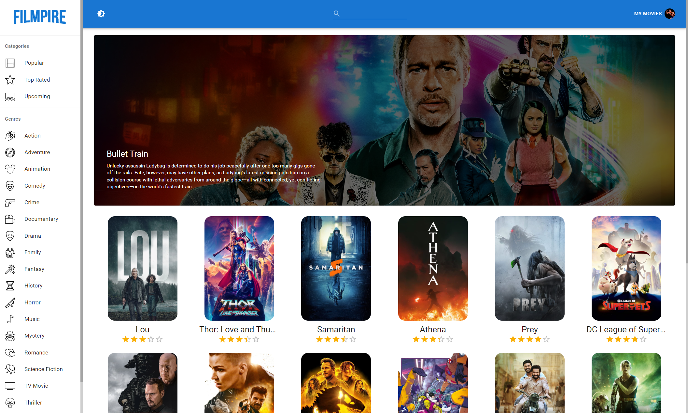

# Filmpire🍿

## General Info
**Filmpire is a comprehensive movie application where users can discover titles within specific categories and genres, save them to watchlists, view trailers for upcoming films, and access information about the cast, synopsis, and more..** 
<a href="https://filmpire-37.netlify.app/" target="_blank" >👉🎯👈</a>

***

Technologies:
- React JS
- Redux
- Material UI 5

## Available Scripts

In the project directory, you can run:

### `npm start`

Runs the app in the development mode.\
Open [http://localhost:3000](http://localhost:3000) to view it in your browser.
